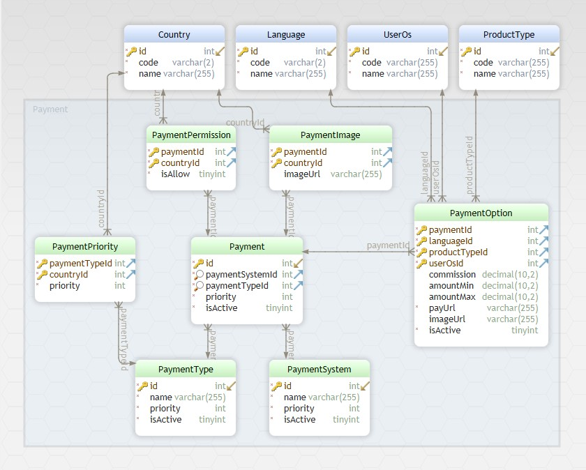

INSTALL
-------------

- Import db from `backup.sql`

- `composer install`

CONFIGURATION
-------------

### Database

Edit the file `config/db.php` with real data, for example:

```php
return [
    'class' => 'yii\db\Connection',
    'dsn' => 'mysql:host=localhost;dbname=yii2basic',
    'username' => 'root',
    'password' => '1234',
    'charset' => 'utf8',
];
```

### Entry point

`http://localhost/index.php?productType=book&amount=0.3&lang=es&countryCode=IN&userOs=windows`

### Params

```
productType = book | reward | walletRefill
amount = 0.30
lang = en | es | uk
countryCode = IN | CO |... country code in ISO-3166 format
userOs = android | ios | windows
```

DB MODEL
------------


